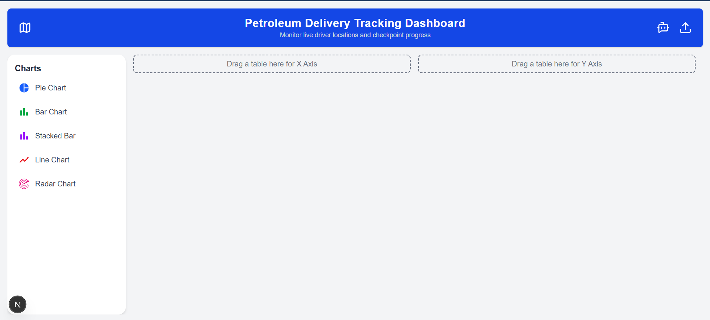
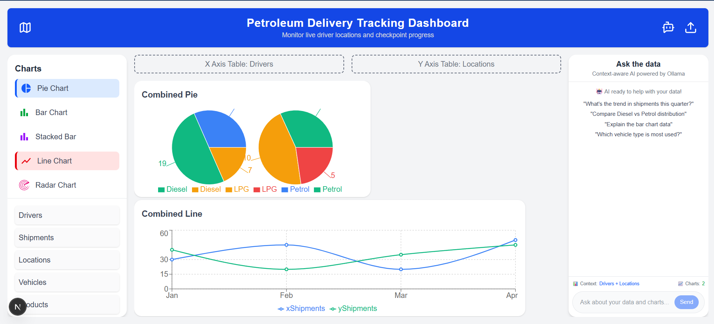
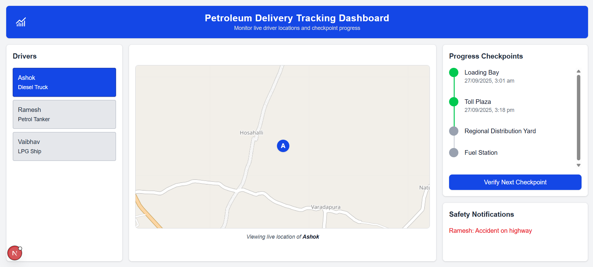

# Logistics Intelligence Dashboard (Website)

An **AI-powered logistics management and analytics platform** that helps companies manage their fleets, drivers, cargo, and safety reports – all in one place.  
Built with **Next.js, React, TailwindCSS, and Firebase**, the dashboard is fully customizable with drag-and-drop widgets, resizable graphs, and AI-driven insights.

---

## Features

### Data & Dashboard
- Upload structured data (CSV/Excel/API).
- Automatic table generation:
  - Drivers
  - Locations
  - Products / Cargo
- Choose any table fields as **X / Y axes** for visualization.
- Fully customizable dashboards:
  - Drag-and-drop layout
  - Resizable graphs
  - Save and share dashboards

### Driver & Cargo Tracking
- Track driver journeys across checkpoints (A → B → C).
- Real-time updates from the mobile app.
- Safety alerts raised by drivers visible instantly on dashboard.

### AI Assistant
- Fine-tuned **LLaMA 3 (1.1B)** model with **RAG pipeline**.
- Natural language queries on uploaded data:
  - “Show total petroleum delivered by Driver X this month.”
  - “Compare safety incidents across locations.”
- Data aggregation and reporting with plain-text questions.

### Safety & Compliance
- Drivers can raise safety concerns (synced with dashboard).
- Admins view and resolve issues in real-time.

---

## Related Project: Driver Mobile App
This dashboard is tightly integrated with the [**Driver Companion Mobile App**](https://github.com/your-org/driver-app).  
The mobile app allows drivers to:
- View cargo details
- Update checkpoints
- Raise safety alerts
- Access an AI assistant for cargo-related questions

All updates from the mobile app are instantly reflected in this dashboard.

---

## Screenshots

---

## Tech Stack
- **Frontend:** Next.js, React, TailwindCSS
- **Backend:** Firebase (Auth, Firestore, Hosting)
- **AI:** Local LLaMA 3 (1.1B) + Retrieval-Augmented Generation (RAG)
- **Charts & Visualization:** Custom Graph Components
